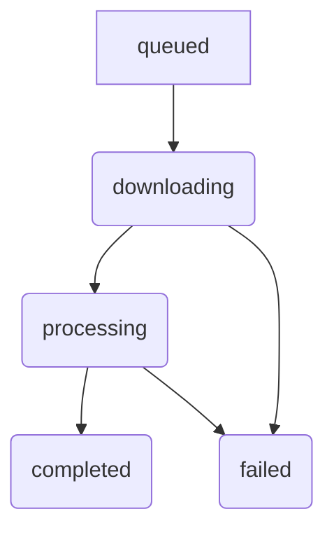

# 資料模型：多格式影片片段下載器

## 實體：DownloadJob

代表一個使用者請求的下載與剪輯操作。

### 屬性

| 屬性 | 類型 | 描述 | 範例 | 驗證規則 |
|---|---|---|---|---|
| `url` | string | 影片的來源 URL | `"https://www.youtube.com/watch?v=..."` | 必須是有效的 URL |
| `start_time` | string | 剪輯的起始時間 (HH:MM:SS) | `"00:01:30"` | 格式必須是 HH:MM:SS |
| `end_time` | string | 剪輯的結束時間 (HH:MM:SS) | `"00:02:00"` | 格式必須是 HH:MM:SS |
| `output_path` | string | 儲存檔案的目錄路徑 | `"D:\\Downloads"` | 必須是有效的目錄路徑 |
| `output_filename` | string | 輸出的檔案名稱 | `"my-clip.mp4"` | 必須是有效的檔案名稱 |
| `status` | string | 任務的目前狀態 | `"downloading"` | 必須是 `queued`, `downloading`, `processing`, `completed`, `failed` 中的一個 |
| `progress` | integer | 任務的完成百分比 | `50` | 0-100 之間的整數 |

### 狀態轉換



- **queued**: 任務已創建並等待執行。
- **downloading**: 正在從 URL 下載影片。
- **processing**: 正在剪輯和轉碼影片。
- **completed**: 任務已成功完成。
- **failed**: 任務因錯誤而失敗。

```